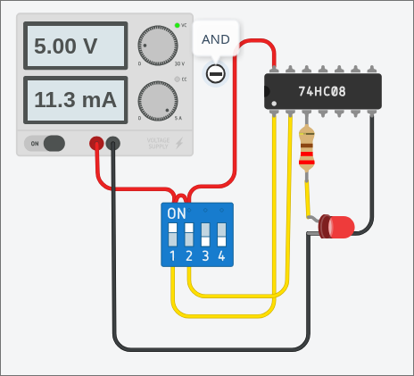
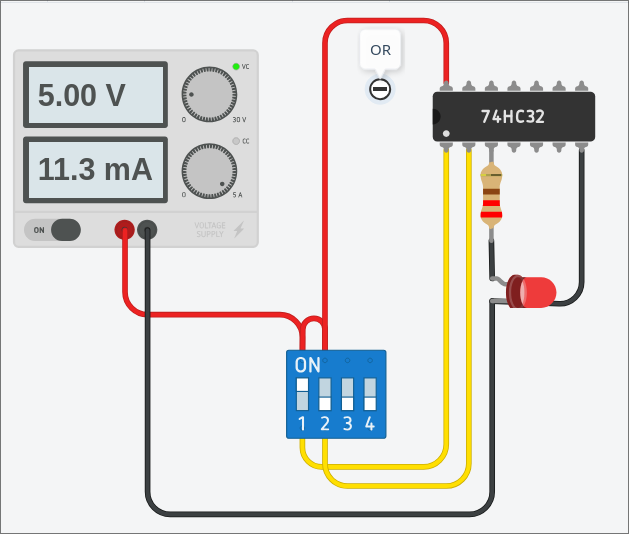
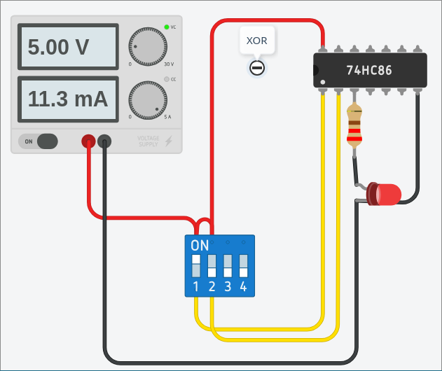
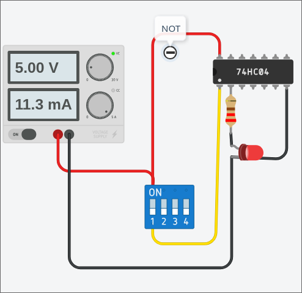
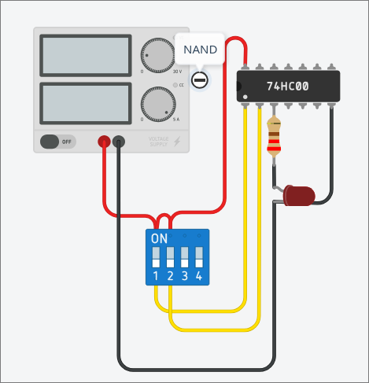
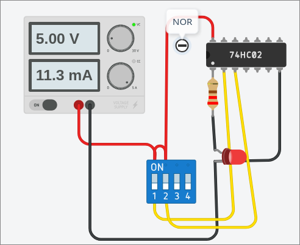
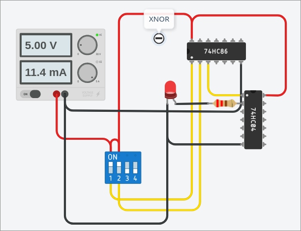

# tugas-praktikum-sistem-digital

[tinkercad](https://www.tinkercad.com/things/5JvAO1YWAFg-logic-gates?sharecode=ODU0HKKxdrZtanzL3hIj2boGru_dTqrUo-RFRPn5vxE)

## 1. AND

Gerbang AND adalah salah satu gerbang logika dasar yang berfungsi sebagai pengali bilangan. Gerbang ini memiliki dua atau lebih jalur input dan hanya memiliki satu jalur output. Output gerbang AND hanya akan bernilai logika HIGH (1) jika dan hanya jika semua jalur inputnya secara bersamaan bernilai logika HIGH (1). Jika ada salah satu saja input yang bernilai logika LOW (0), maka otomatis output yang dihasilkan juga akan bernilai LOW (0). Gerbang ini memiliki peran penting dalam pengondisian, rangkaian latch, dan pemrosesan data biner pada perangkat komputer

| A | B | A . B |
| - | - | ----- |
| 0 | 0 | 0 |
| 1 | 0 | 0 |
| 0 | 1 | 0 |
| 1 | 1 | 1 |

## 2. OR

Gerbang OR adalah gerbang logika dasar yang berfungsi sebagai penjumlah logika. Prinsip kerjanya sangat sederhana: output akan bernilai logika HIGH (1) jika salah satu atau semua inputnya bernilai HIGH (1). Satu-satunya kondisi di mana output akan bernilai LOW (0) adalah ketika seluruh inputnya secara bersamaan bernilai LOW (0). 

Dalam rangkaian tinkercad, kita dapat menggunakan IC 74HC32. Komponen ini berisi sekumpulan gerbang OR dalam satu modul. IC 74hc32 memiliki susunan input-input-output. 

| A | B | A + B |
| - | - | ----- |
| 0 | 0 | 0 |
| 1 | 0 | 1 |
| 0 | 1 | 1 |
| 1 | 1 | 1 |

## 3. XOR

Gerbang XOR adalah gerbang logika yang memberikan output HIGH (1) hanya jika kedua inputnya memiliki nilai yang berbeda. Jika kedua input bernilai sama (keduanya 0 atau keduanya 1), maka outputnya akan bernilai LOW (0). Karena karakteristik ini, gerbang XOR sering digunakan sebagai dasar rangkaian aritmatika komputer, seperti Half Adder dan Full Adder, untuk menjumlahkan angka biner.

IC 74HC86 dapat kita gunakan untuk mensimulasikan rangkaian pada tinkercad. Modul ini adalah sirkuit terpadi yang berisi gerbang XOR ke dalam satu komponen fisik. Sama seperti 74HC32 (OR), IC ini memiliki susunan pin standar yang memudahkan proses wiring di breadboard atau simulator. IC bekerja pada rentang tegangan 2V hingga 6V.

| A | B | A o B |
| - | - | ----- |
| 0 | 0 | 0 |
| 1 | 0 | 1 |
| 0 | 1 | 1 |
| 1 | 1 | 0 |

## 4. NOT

Gerbang NOT, atau sering disebut sebagai Inverter (Pembalik), adalah gerbang logika yang berfungsi untuk membalikkan keadaan sinyal input. Jika input yang dimasukkan bernilai HIGH (1), maka output yang dihasilkan akan menjadi LOW (0), dan sebaliknya. Gerbang ini sangat penting dalam sistem digital untuk menciptakan logika negasi atau mengaktifkan komponen yang bersifat active-low.

IC 74HC04 adalah sirkuit terpadu yang berisi gerbang NOT di dalamnya. Berbeda dengan IC gerbang logika sebelumnya yang biasanya hanya berisi 4 gerbang dalam satu chip, IC 74HC04 berisi 6 gerbang NOT sekaligus (disebut sebagai Hex Inverter). Hal ini dimungkinkan karena setiap gerbang hanya membutuhkan dua pin (satu input dan satu output).

| A | A' |
| - | -- |
| 1 | 0 |
| 0 | 1 |

## 5. NAND

Gerbang NAND (Not-AND) adalah kombinasi dari gerbang AND yang diikuti oleh gerbang NOT. Secara logika, gerbang ini bekerja berbalikan dengan gerbang AND. Outputnya akan bernilai LOW (0) hanya jika semua inputnya bernilai HIGH (1). Dalam kondisi lainnya (jika ada salah satu atau semua input bernilai rendah), maka outputnya akan selalu bernilai HIGH (1).

IC 74HC00 adalah komponen yang berisi kumpulan gerbang NAND. Sama seperti IC AND atau OR, IC ini memiliki susunan pin yang standar (Input-Input-Output).

| A | B | (A . B )'|
| - | - | -------- |
| 0 | 0 | 1 |
| 1 | 0 | 1 |
| 0 | 1 | 1 |
| 1 | 1 | 0 |

## 6. NOR

Gerbang NOR (Not-OR) adalah gerbang logika yang merupakan kebalikan dari gerbang OR. Secara fungsional, gerbang ini memberikan output HIGH (1) hanya jika semua inputnya bernilai LOW (0). Jika salah satu atau seluruh input bernilai HIGH (1), maka output yang dihasilkan akan menjadi LOW (0). Sama halnya dengan NAND, gerbang NOR juga menyandang gelar "Universal Gate" karena dapat digunakan untuk membangun segala jenis fungsi logika lainnya.

IC 74HC02 adalah sirkuit terpadu yang berisi empat gerbang NOR. Susunan pin gerbang NOR ini adalah Ouput-Input-Input berbeda seperti kebanyakan IC 74HC yang lain.

| A | B | (A + B)' |
| - | - | -------- |
| 0 | 0 | 1 |
| 1 | 0 | 0 |
| 0 | 1 | 0 |
| 1 | 1 | 0 |

## 7. XNOR

Gerbang XNOR (Exclusive-NOR) adalah gerbang logika yang merupakan kombinasi dari gerbang XOR dan gerbang NOT. Gerbang ini sering disebut sebagai equivalence gate karena outputnya hanya akan bernilai tinggi jika kedua inputnya memiliki kondisi yang sama. Secara fungsional, gerbang XNOR akan menghasilkan output logika HIGH (1) jika kedua inputnya bernilai sama (keduanya 0 atau keduanya 1). Sebaliknya, jika kedua inputnya berbeda, maka output yang dihasilkan akan bernilai LOW (0). Dalam rangkaian digital, XNOR sering digunakan sebagai comparator untuk mengecek apakah dua sinyal memiliki nilai yang sama.

Rangkaian XNOR ini menggabungkan antara gerbang XOR dengan gerbang NOR secara bertahap. Pertama-tama, dua input switch dipasangkan ke gerbang XOR. Dari hasil output gerbang XOR tersebut kemudian dinegasikan menggunakan IC 74HC04 sebagai output dari rangkaian XNOR.

| A | B | (A o B)' |
| - | - | ----- |
| 0 | 0 | 1 |
| 1 | 0 | 0 |
| 0 | 1 | 0 |
| 1 | 1 | 1 |

